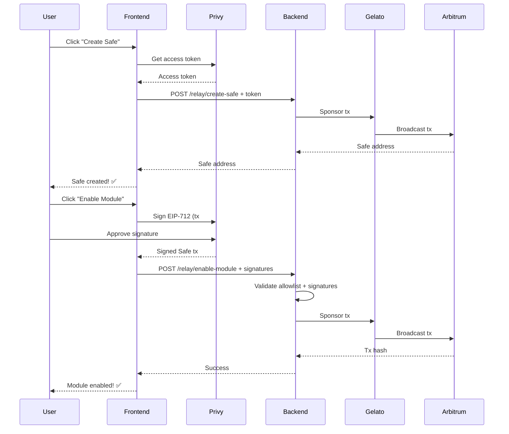

# Frontend Configuration Guide

## Required Environment Variables

Add these to your `.env.local` or `.env` file in the frontend (n8n) directory:

### Backend API URL
```bash
NEXT_PUBLIC_API_BASE_URL=http://localhost:3000/api/v1
```

For production:
```bash
NEXT_PUBLIC_API_BASE_URL=https://your-backend-domain.com/api/v1
```

### Privy Configuration (Already Configured)
```bash
NEXT_PUBLIC_PRIVY_APP_ID=your-privy-app-id
```

### Contract Addresses (Already Configured)

Make sure these are set for both networks:

**Arbitrum Sepolia (421614):**
```bash
NEXT_PUBLIC_SAFE_WALLET_FACTORY_ADDRESS=0x...
NEXT_PUBLIC_SAFE_MODULE_ADDRESS=0x...
```

**Arbitrum Mainnet (42161):**
```bash
NEXT_PUBLIC_MAINNET_SAFE_WALLET_FACTORY_ADDRESS=0x...
NEXT_PUBLIC_MAINNET_SAFE_MODULE_ADDRESS=0x...
```

## Changes Made

### 1. `usePrivyWallet.ts`
- Added `getPrivyAccessToken()` function to get Privy access tokens for backend API authentication
- This token is required for all relay endpoints

### 2. `useCreateSafeWallet.ts`
**Major changes:**
- **Tx #1 (createSafeWallet)**: Now calls `POST /api/v1/relay/create-safe` instead of directly calling the factory contract
- **Tx #2 (signEnableModule)**: Updated to use Privy EIP-1193 provider instead of `window.ethereum`
- **Tx #3 (submitEnableModule)**: Now calls `POST /api/v1/relay/enable-module` instead of directly executing the Safe transaction

**Benefits:**
- ✅ Fully gasless for users (both Safe creation and module enable)
- ✅ Works with Privy email-only wallets (no external wallet needed)
- ✅ No "wildcard contract address" limitation
- ✅ Backend enforces security policies (only your module can be enabled)

## User Flow (New)



## Testing the Integration

### 1. Test Privy Login
```typescript
import { usePrivy } from "@privy-io/react-auth";
import { usePrivyWallet } from "@/hooks/usePrivyWallet";

const { login, authenticated } = usePrivy();
const { getPrivyAccessToken, wallet } = usePrivyWallet();

// Login
await login();

// Get token
const token = await getPrivyAccessToken();
console.log("Access token:", token);
console.log("Wallet address:", wallet?.address);
```

### 2. Test Safe Creation
```typescript
import { useCreateSafeWallet } from "@/web3/hooks/useCreateSafeWallet";

const { createSafeWallet } = useCreateSafeWallet();

const result = await createSafeWallet(userAddress);
if (result.success) {
  console.log("Safe created:", result.safeAddress);
} else {
  console.error("Error:", result.error);
}
```

### 3. Test Module Enable
```typescript
const { signEnableModule, submitEnableModule } = useCreateSafeWallet();

// Step 1: Sign (user approval via Privy)
const signResult = await signEnableModule(safeAddress);
if (!signResult.success) {
  console.error("Sign error:", signResult.error);
  return;
}

// Step 2: Submit (backend relays)
const submitResult = await submitEnableModule();
if (submitResult.success) {
  console.log("Module enabled! Tx:", submitResult.data?.transactionHash);
} else {
  console.error("Submit error:", submitResult.error);
}
```

## Error Handling

Common errors and solutions:

### "Authentication required. Please log in with Privy."
- User is not logged in with Privy
- Call `usePrivy().login()` first

### "Privy wallet not available. Please log in."
- Privy embedded wallet hasn't been created yet
- Ensure user has completed Privy onboarding

### "Network error. Please check your connection."
- Backend is not reachable
- Check `NEXT_PUBLIC_API_BASE_URL` is correct
- Ensure backend is running

### "Server error: 401"
- Invalid or expired Privy access token
- User needs to re-login

### "Server error: 429"
- Rate limit exceeded
- User has created too many Safes/enabled too many modules
- Wait and try again later

### "Can only enable module 0x..."
- Backend rejected the transaction
- The transaction is not exactly `enableModule(yourModuleAddress)`
- Check that you're using the correct module address

## Security Notes

1. **Access tokens are short-lived**: Privy access tokens expire. The frontend automatically gets fresh tokens on each API call.

2. **Backend validates everything**: Even though the frontend sends the transaction data, the backend validates:
   - User is authenticated (valid Privy token)
   - User is a Safe owner
   - Transaction is exactly `enableModule(allowedModuleAddress)`
   - Signatures are valid and meet threshold
   - Rate limits are not exceeded

3. **No private keys in frontend**: The user's private key never leaves Privy's secure environment.

4. **Gelato sponsorship is controlled**: Only your backend can trigger sponsored transactions, and only for validated actions.

## Next Steps

1. **Deploy backend** with Gelato API key and contract addresses
2. **Fund Gelato 1Balance** with enough ETH for gas sponsorship
3. **Test on Arbitrum Sepolia** first
4. **Deploy to production** (Arbitrum mainnet)
5. **Monitor Gelato dashboard** for task status and balance

## Support

- Gelato Dashboard: https://app.gelato.network
- Gelato Docs: https://docs.gelato.network/developer-services/relay
- Privy Docs: https://docs.privy.io

